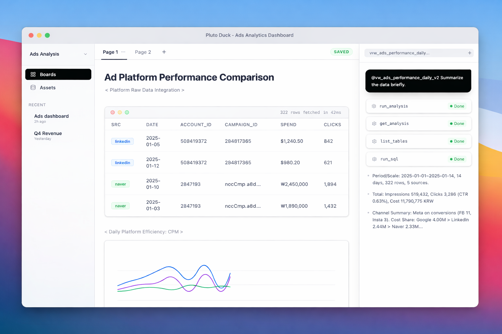

# Pluto-Duck OSS

**Local-first Analytics Studio** powered by **DuckDB** and an **AI Data Agent**.  
Chat with your data, build pipelines, and manage analytics assets—all on your local machine.

<p align="center">
  
</p>

## 🌟 Product Vision

**"Chat is ephemeral, Assets are persistent."**

Pluto Duck bridges the gap between ad-hoc chat analysis and reproducible data pipelines. It combines a natural language interface with a robust SQL workbench, allowing you to seamlessly transition from "asking questions" to "building dashboards."

- **🔒 Privacy First**: Your data never leaves your machine. The AI agent runs locally or connects to your provider of choice, but the data processing happens right on your laptop.
- **⚡ High Performance**: Built on **DuckDB** for blazing fast analytical queries on local and remote data.
- **🧠 Agentic Workflow**: An AI agent that doesn't just write SQL—it plans, executes, fixes errors, and suggests reusable assets.

---

## ✨ Key Features

### 1. Zero-Copy Data Federation
Connect directly to your databases and lakes without painful ETL.
- **Live Query**: Attach PostgreSQL, MySQL, SQLite, and S3 buckets instantly using DuckDB's `ATTACH` feature.
- **Smart Caching**: The agent intelligently suggests caching heavy datasets locally for better interactive performance.

### 2. DuckPipe: The Invisible Pipeline Engine
A built-in lightweight SQL pipeline engine designed for the "Chat-to-Asset" flow.
- **Dependency Tracking**: Automatic DAG generation from SQL table references.
- **Freshness Checks**: Smart execution that only re-runs stale parts of the pipeline.
- **Code as File**: Analyses are saved as YAML/SQL files, making them Git-friendly and human-readable.

### 3. Asset Management System
Turn chat conversations into lasting value.
- **Saved Analysis**: Convert ad-hoc queries into scheduled, versioned assets.
- **Lineage Tracking**: Visual tracking of data flow from raw source to final insight.
- **Boards**: Organize charts, tables, and notes into persistent dashboards.

### 4. DeepAgents Runtime
A file-system based agent architecture designed for complex tasks.
- **Skills System**: Extensible agent capabilities defined in Markdown (`SKILL.md`).
- **Human-in-the-Loop**: You stay in control with approval gates for data modifications.
- **Long-running Sessions**: Persistent context allows for multi-day analysis tasks.

---

## 🏗 Architecture: The 3-Zone Model

Pluto Duck organizes your data workflow into three logical zones to balance agility and stability:

1.  **Raw Zone (Source Attach)**: Live connections to external DBs. Metadata only, no data copying.
2.  **Work Zone (Session Cache)**: Temporary, high-speed local storage for active analysis and experimentation.
3.  **Asset Zone (Materialized)**: Permanent, versioned data products and pipelines.

---

## 📂 Project Layout

- `backend/pluto_duck_backend`: FastAPI service, API endpoints, and Agent runtime.
- `backend/duckpipe`: **New!** Lightweight SQL pipeline library (dbt replacement).
- `backend/deepagents`: File-system based agent state, memory, and skills.
- `packages/pluto_duck_cli`: CLI tool for terminal-based analysis.
- `frontend/pluto_duck_frontend`: Next.js web interface (Chat & Board).
- `tauri-shell`: macOS Desktop application wrapper.

---

## 🚀 Getting Started

### Prerequisites
- Python 3.10+
- Node.js 18+ (for frontend)
- Rust (for desktop app build)

### Installation

```bash
# 1. Setup Python Environment
python -m venv .venv
source .venv/bin/activate
pip install -e .[dev]

# 2. Run Backend & Frontend (Dev Mode)
./scripts/dev.sh
```

### CLI Usage

```bash
# Run a quick query via CLI agent
pluto-duck agent-stream "Show me top customers from my postgres db"
```

Agent responses are streamed via SSE. Each event carries structured JSON describing reasoning updates, tool outputs, and final summaries.

---

## 🗺 Roadmap & Status

- ✅ **Phase 1: Backend Core** - OSS backend, API, CLI.
- ✅ **Phase 2: Chat Interface** - Multi-turn chat, basic visualizations.
- ✅ **Phase 3: Desktop App** - Tauri integration for macOS.
- ✅ **Phase 4: New Data Architecture**
    - DuckPipe Engine implementation
    - Asset System & Lineage
    - Live Data Federation (Postgres/MySQL/S3)
- 🚧 **Phase 5: Advanced Agent Skills** - Multi-step reasoning, complex reporting.

See `docs/Pluto_Duck_new_flow.md` for details on the new architecture.
